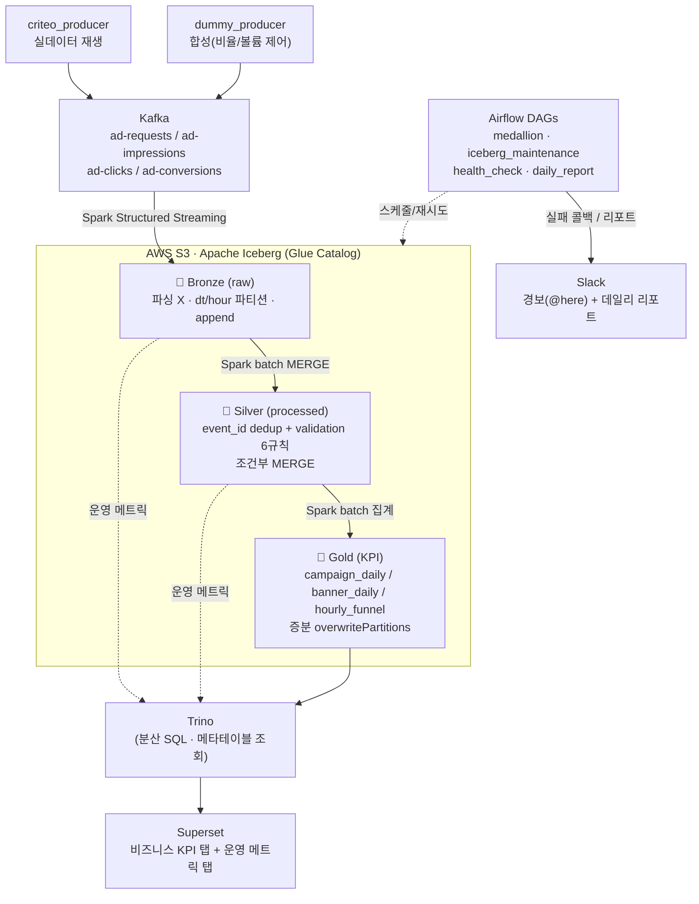
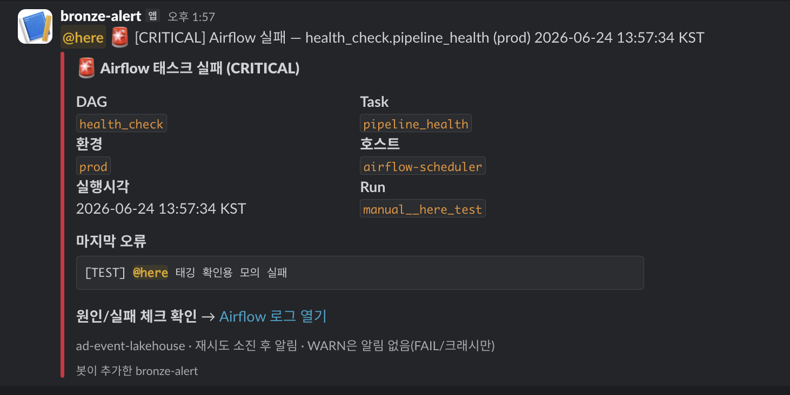
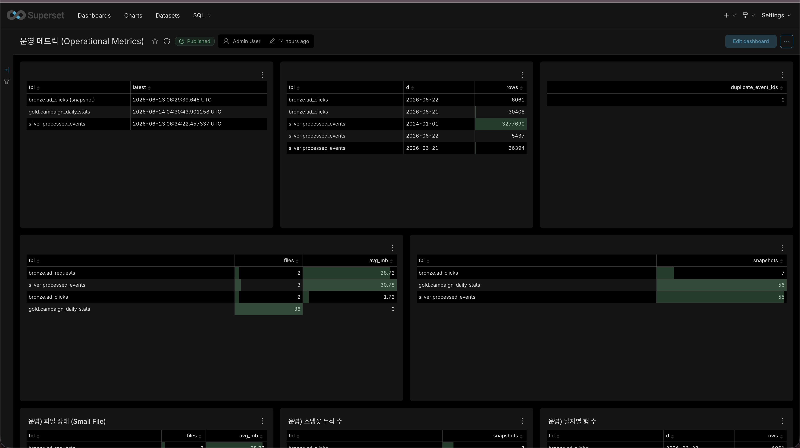
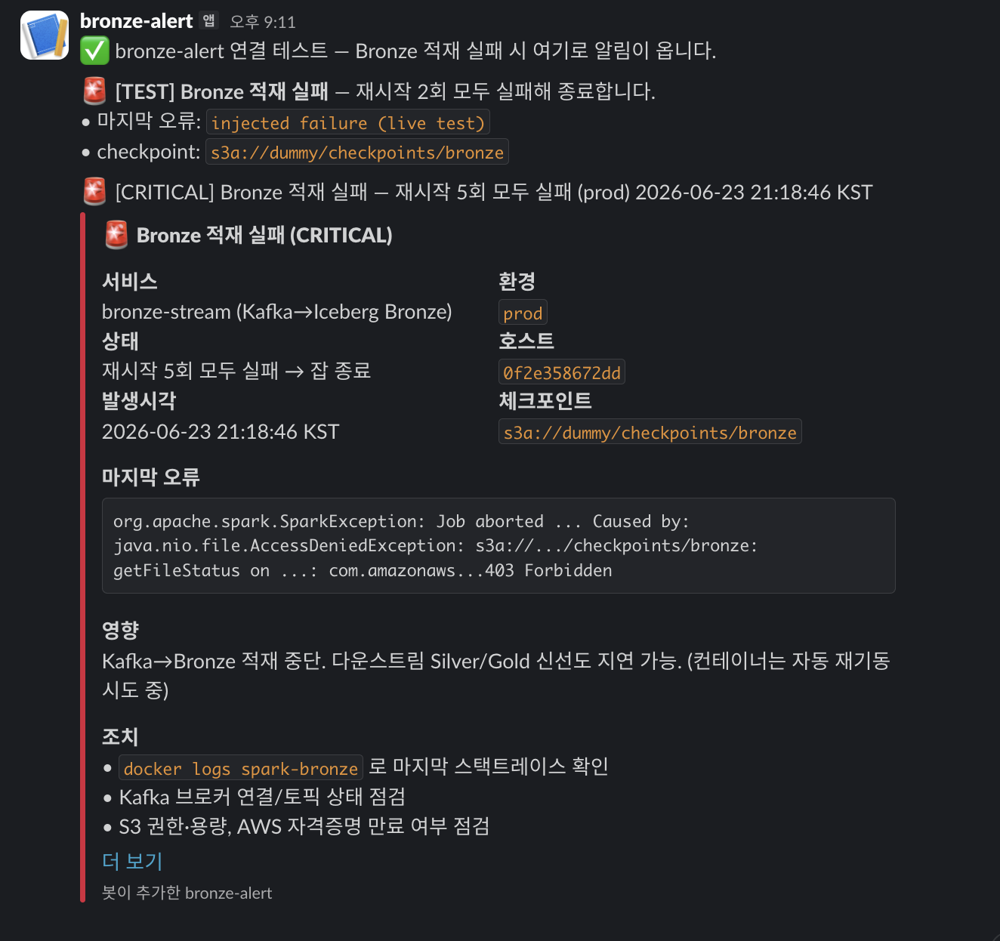
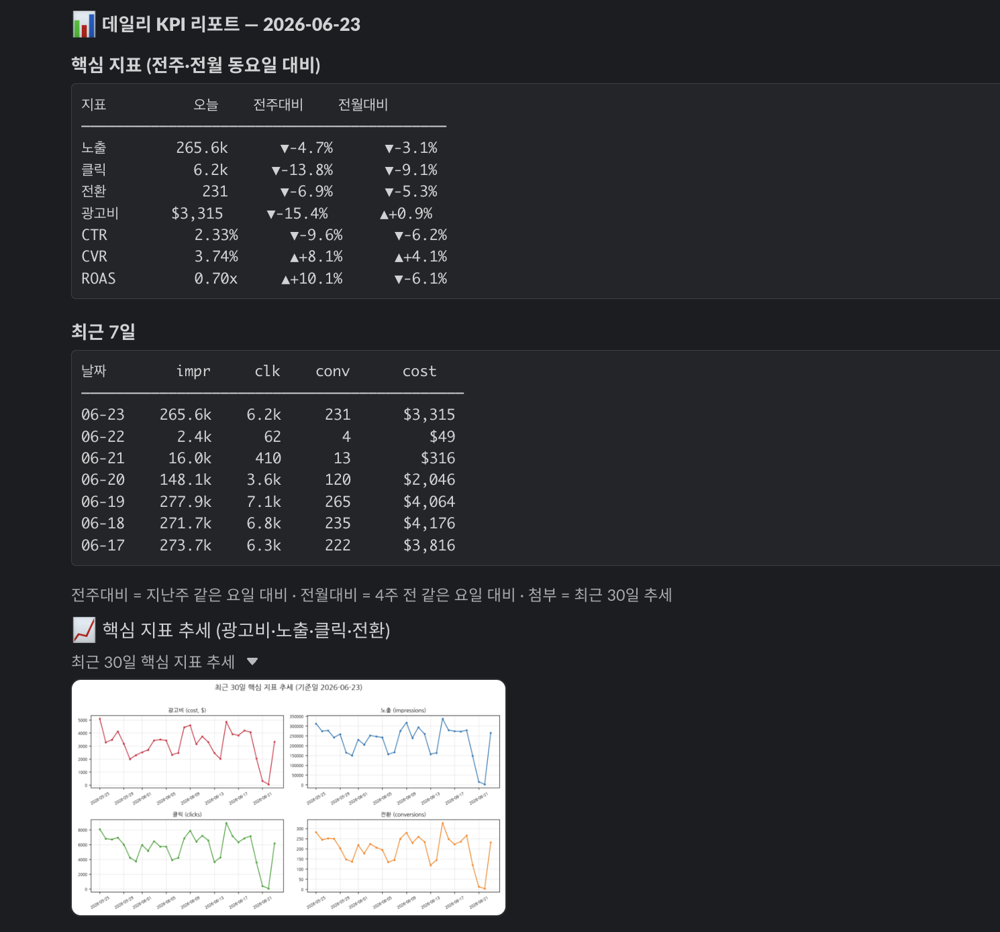

# 광고 이벤트 레이크하우스 (Ad-Event Lakehouse)

> 실제 광고 데이터(Criteo)를 재생하고 합성 이벤트를 섞어 **Kafka**로 흘려보내고,
> **Spark + Apache Iceberg**(Glue Catalog / S3)로 **메달리온(Bronze→Silver→Gold)** 파이프라인을 돌린 뒤,
> **Trino + Superset**으로 서빙, **Airflow**로 오케스트레이션, **Slack**으로 운영 알림/리포트를 붙인 프로젝트.

[](https://github.com/SMJ426/ad-event-lakehouse/actions/workflows/ci.yml)

이 프로젝트의 관점은 **"파이프라인을 어떻게 구성했나"가 아니라, "실제로 운영한다고 가정하고 무엇을 고민·해결했고 어떤 자세로 임했나"** 이다. 부트캠프에서 처음 접한 기술이 대부분이라 "그냥 쓰기"로 끝내지 않고 — **왜 이 기술인가, 다른 방법은 없나, 어떤 상황에서 더 유의미한가** — 를 계속 물으며 만들었다. 그 고민의 기록은 [부록](#부록-구현-중-고민의사결정-기록)에 있다.

### 차별점 4기둥

| 축 | 내용 |
|---|---|
| **도메인 현실성** | OpenRTB 2.6 형식 · 퍼널 전체 4토픽(request 포함 → fill_rate) · producer 2종(합성=비율/볼륨 제어, Criteo=실분포) |
| **운영 가시성** | 5분 헬스체크(메타테이블 8종 자동 판정) · 대시보드 운영 탭 · Slack 경보/데일리 리포트 |
| **실무형 고민·해결** | 실제 장애(Kafka 볼륨 유실) · 멱등성 · 백필 · OCC 충돌 회피 · 100x 스케일 사고 |
| **지속가능성** | 단위 테스트 + CI(PR마다 자동) · `CLAUDE.md` · 공통 모듈 · `.env` 비밀 관리 |

### 환경

**로컬 Docker 환경**으로 구현했다(AWS S3 + Glue Catalog는 실제 사용, 컴퓨트는 로컬 Spark/Trino). 단일 노드의 한계와 클라우드(EKS/Glue·EMR) 전환 지점은 [§7 스케일 아웃](#7-100x-스케일-아웃-시나리오)에서 다룬다.

### Quick Start

```bash
cd infra
docker compose -f docker-compose.yaml           up -d   # ① Bronze 적재 (Kafka → S3)
docker compose -f docker-compose.airflow.yaml    up -d   # ② Silver/Gold/health/report — Airflow UI :8082 (admin/admin)
docker compose -f docker-compose.dashboard.yaml  up -d   # ③ 대시보드 — Superset :8088 (admin/admin)
```

- **필수 env**: `infra/.env`에 `S3_BUCKET=...` (+ 선택 `SLACK_WEBHOOK_URL`/`SLACK_BOT_TOKEN`/`SLACK_REPORT_CHANNEL`). AWS 자격증명은 `~/.aws` 마운트(코드에 키 하드코딩 X).
- 자세한 실행/컨벤션/주의는 [`CLAUDE.md`](CLAUDE.md), 설계 정본은 [`docs/architecture.md`](docs/architecture.md) 참고.

📊 **발표 자료: [`slides.pdf`](slides.pdf)** (총 31장 · ~33분)

---

## 1. 도메인 정의 + 핵심 KPI

**도메인:** 광고 이벤트(Ad Event). 광고 노출(impression) → 클릭(click) → 전환(conversion)으로 이어지는 퍼널을, 그 앞단의 슬롯 요청(request)까지 포함해 다룬다.

**규모 가정:** 일 100만 이벤트(시간당 ~4만, 초당 ~12) → 6개월 내 10x, 1~2년 내 100x(일 1억) 성장 가정. 이 가정이 스케일 아웃 설계의 근거다.

**핵심 KPI (비즈니스):**

| KPI | 계산식 | 설명 |
|-----|--------|------|
| Fill Rate | impression / request | 광고 슬롯이 채워진 비율 |
| CTR | click / impression | 클릭률 |
| CVR | conversion / click | 전환율 |
| CPA | cost / conversion | 전환당 비용 |
| ROAS | conversion × 단가 / cost | 광고비 대비 매출 |

> **Gold KPI 날짜 기준(중요):** 각 이벤트의 **발생일(event_date) 기준** 집계(attribution 미적용). `cost = SUM(cost) FILTER(event_type='click')`(CPC 모델), `ROAS = 전환수 × 가정단가($10) / cost`. attribution(예: 14일 윈도우)은 matching table 분리 시 확장 가능(추후 과제).

---

## 2. 전체 아키텍처

**핵심 원칙: write = Spark / read = Trino 분리.** BI 도구는 Iceberg 파일을 직접 고치지 않고, SQL 엔진(Trino)에 질의하면 Trino가 Glue 카탈로그와 Iceberg 메타데이터를 해석한다.



- **producers → Kafka(4토픽)**: OpenRTB 2.6 기반 공통 스키마, `source` 필드로 dummy/web/criteo 구분.
- **Bronze**: Spark Structured Streaming이 원본 그대로 적재(at-least-once). 파싱/변환 없음.
- **Silver/Gold**: Spark 배치가 정제·집계. Airflow가 스케줄.
- **서빙**: Trino가 읽고 Superset이 대시보드로 보여줌.
- **오케스트레이션/알림**: Airflow DAG + Slack.

---

## 3. 메달리온 3계층 의사결정

| 계층 | 역할 | 저장/처리 | 업데이트 패턴 |
|---|---|---|---|
| 🥉 **Bronze** (raw) | 원본 영구 보존 | Iceberg · `dt`/`hour` 파티션 | append-only (Streaming) |
| 🥈 **Silver** (processed) | 정제 + 품질 검증 | Iceberg · `event_date` 파티션 | 조건부 MERGE (dedup + validation) |
| 🥇 **Gold** (summary) | KPI 집계 · 서빙 | Iceberg | 증분 `overwritePartitions` |

### 3-1. Bronze — raw, "막지 말고 흡수한다"

Streaming이 원본을 그대로 쌓는다. 재시작 과정에서 중복이 생길 수 있지만(at-least-once), **Bronze는 중복을 막지 않고 Silver가 걸러낸다.** raw를 영구 보존하는 이유가 바로 재처리 가능성 — 정제 로직에 버그가 있어도 Bronze에서 언제든 다시 만들 수 있다.

### 3-2. Silver — dedup ≠ 품질 검증

- **dedup**: `event_id` 기준 중복 제거(ROW_NUMBER, latest wins).
- **validation 6규칙** (`silver_processed.py`의 `validate()` — 적재 전 무효 행 drop):
  `null_event_id` / `bad_event_type` / `null_campaign_id` / `null_uid` / `negative_cost` / `timestamp_out_of_range`
- **dedup은 "같은 걸 두 번 안 세기", validation은 "옳지 않은 값 거르기"** — 다른 책임이라 validation을 dedup **앞**에 둔다(null event_id가 dedup 키를 오염시키지 않게).
- **Criteo 오제거 방지**: Criteo는 device_type/os/country가 정상 NULL이므로 null 검사는 공통 키(event_id/campaign_id/uid)에만 적용.

### 3-3. Gold — 대시보드 역방향 설계 + 증분

대시보드에서 거꾸로 설계한다("Gold를 잘 만들려면 대시보드를 먼저 정한다"). 각 Gold 테이블이 어떤 대시보드 뷰를 서빙하는지 계약을 먼저 고정:

| Gold 테이블 | 대시보드 뷰 | 주 데이터원 |
|---|---|---|
| `campaign_daily_stats` | 캠페인 성과(CTR/CVR/CPA/ROAS, 일별 추세) | dummy(날짜 누적) |
| `banner_daily_stats` | 소재 성과(CTR, peak_hour) | 공통 |
| `hourly_funnel` | 시간대 퍼널(24h fill→CTR→CVR) | criteo(하루치 24h) |

**증분 키 = `updated_at`(Silver 처리시각).** event_date로 윈도우를 잡으면 Criteo(2024년) 데이터가 누락되므로, 처리시각 기준 최근 변경분의 event_date 파티션만 재계산(`overwritePartitions`). late data도 자동 반영.

---

## 4. 왜 Iceberg인가

> *"왜 그냥 Parquet + Glue가 아니라 Iceberg인가?"*

전통 방식(Parquet on S3 + Glue)은 **파일이 어느 폴더에 있는지만 알 뿐, 각 파일 안에 뭐가 들었는지 모른다.** 그래서 파티션 리스팅이 느리고, ACID가 없어 동시 쓰기에 취약하며, 롤백이 불가능하다. 이 도메인에서 Iceberg가 결정적인 지점은 다음과 같다.

| 필요 | Iceberg가 주는 것 |
|---|---|
| **지연 도착 전환** (conversion이 며칠 뒤 도착) | `MERGE INTO` 멱등 upsert — 파티션 전체 재작성 없이 필요한 행만 논리적으로 갱신 |
| **정제 버그 → 3개월 백필** | 스냅샷 격리(snapshot isolation) — 백필 MERGE 중에도 대시보드는 커밋된 스냅샷만 읽음 |
| **컴팩션 ↔ 스트리밍 동시 쓰기** | OCC(낙관적 동시성) — base 스냅샷이 바뀌면 충돌 감지·실패(조용한 덮어쓰기 없음) |
| **Streaming Small File** | `rewrite_data_files` 컴팩션 + `expire_snapshots` + `remove_orphan_files` 자동화 |
| **File Pruning** | 파일별 min/max 통계로 불필요한 파일 스킵 |

**필수 요건 충족:** ① Iceberg 테이블 활용 ② 메달리온 3계층 ③ Iceberg 매니지먼트 자동화(compaction/expire/orphan, [§8](#8-장애운영-시나리오) 참고) ④ 대시보드([§6](#6-대시보드-superset--trino)).

---

## 5. 운영 헬스 체크 쿼리 모음

> **평가기준 ①** "운영자가 매일 5분 안에 파이프라인 헬스체크를 할 수 있는가" — Iceberg 메타테이블
> (`$snapshots`/`$files`) 기반 헬스체크를 **두 화면**으로 제공한다: ⓐ 한 명령 자동 리포트(깊게),
> ⓑ 대시보드 운영 메트릭 탭(매일 슥 — §6).

### ⓐ 한 명령 헬스 리포트 — [`pipeline_health.py`](code/pipelines/pipeline_health.py)
```bash
spark-submit pipeline_health.py
#   임계값 조절: --freshness-min 30 --min-file-mb 32 --max-snapshots 200
```
Iceberg 메타테이블 + 간단 집계로 **8종 체크를 자동 판정**(✅OK / ⚠️WARN / ❌FAIL)해 리포트로 출력.
운영자는 **빨간 것(WARN/FAIL)만** 보면 된다. **FAIL이 하나라도 있으면 exit 1**(Airflow/Slack 게이트 확장 가능).

| # | 체크 | 근거(메타/집계) | 판정 |
|---|---|---|---|
| 1 | 신선도 | bronze=`$snapshots` 최신 committed_at, silver/gold=max(updated_at) | 임계(분) 초과 WARN |
| 2 | small file | `$files` 파일 수·평균 크기 | 평균<32MB & 파일>5 → WARN(컴팩션) |
| 3 | 스냅샷 누적 | `$snapshots` count | 임계 초과 WARN(expire) |
| 4 | 처리량 | silver 오늘(updated_at) 처리 행수 | 0이면 WARN |
| 5 | 중복 | silver `count(*)-count(distinct event_id)` | >0 FAIL |
| 6 | 퍼널 정합 | gold requests≥impressions≥clicks≥conversions | 위반 FAIL |
| 7 | 비율 범위 | gold fill_rate/ctr/cvr ∈ [0,1] | 이탈 FAIL |
| 8 | cost 정합 | gold cost == silver click cost 합(CPC) | 불일치 WARN |

> 예시 출력: `종합: 29개 체크 | ❌ 0 FAIL · ⚠️ 5 WARN · ✅ 24 OK` (WARN=신선도·small file 주의).

**FAIL 시 Slack 경보** (health_check DAG):



### ⓑ 대시보드 운영 메트릭 탭 → §6 (신선도/일자별 행수/파일 상태/스냅샷/중복을 시각화)

### 심화 참조 SQL (엔진별 단건 조회)
- [`code/health-queries/`](code/health-queries/) — `bronze_checks` / `silver_checks` / `gold_checks` /
  `maintenance_checks` (spark-sql·Athena 기준 상세 검증 쿼리).
- [`dashboard/trino_queries.sql`](dashboard/trino_queries.sql) 탭 B — 운영 메트릭 Trino 쿼리(대시보드 차트 뒤).

---

## 6. 대시보드 (Superset + Trino)

**스택**: `Superset(BI) → Trino(쿼리엔진) → Glue Catalog + Iceberg → S3`. Spark가 write, Trino가 read.
(강의 7회차 p.26 "팀 BI" 권장 조합 = Spark + Iceberg + Trino + Superset.)

**실행**: `docker compose -f infra/docker-compose.dashboard.yaml up -d --build` → Superset http://localhost:8088 (admin/admin). Trino DB "Iceberg (Trino)" 사전 등록됨. 상세·차트 쿼리는 [dashboard/](dashboard/README.md) 참고.

**두 탭 구성** (비즈니스 KPI + 운영 메트릭):
- **비즈니스 KPI 탭** (Gold): 전체 CTR/CVR/ROAS 빅넘버, 캠페인 성과 Top, 시간대 퍼널(hourly_funnel), 소재 CTR.
- **운영 메트릭 탭** : 신선도(updated_at/최신 스냅샷), 일자별 행 수, 중복 event_id, **파일 수·평균 크기**(`$files`), 스냅샷 수(`$snapshots`) — Iceberg 메타테이블을 Trino로 조회.

**운영 메트릭 탭:**



> 비즈니스 KPI 탭을 포함한 전체 화면은 발표 자료 [`slides.pdf`](slides.pdf) 참조. 운영 메트릭 탭은 [`dashboard/superset_operational_dashboard.zip`](dashboard/superset_operational_dashboard.zip)을 Superset에 import하면 그대로 재현된다(DB 연결 + 데이터셋 5 + 차트 5 + 대시보드).

---

## 7. 100x 스케일 아웃 시나리오

> *"일 100만 → 일 1억(100x)이 되면 어디가 깨지고, 어떻게 스케일 아웃하는가?"* (설계만, 구현 X)

핵심 원칙: **로컬은 단순하게 두되, 병목 지점마다 EKS/매니지드 전환이 쉬운 구조로 만든다.**

| 병목 | 지금(로컬) | 100x 대응 |
|---|---|---|
| **Kafka 단일 브로커** | Docker 단일 브로커 (SPOF) | EKS + 다중 브로커(복제·PVC durability) |
| **Spark 소비량** | `maxOffsetsPerTrigger`로 배치 상한(로컬 OOM 방지) | EKS executor 오토스케일 — Kafka lag 기반 **KEDA/HPA** |
| **Spark worker (컴퓨트)** | standalone worker 1 (같은 맥북 자원 분할 = 흉내) | 매니지드 Spark(**Glue/EMR Serverless**) 또는 Spark on K8s로 진짜 수평 확장 |
| **Trino 메모리** | 세 스택 동시 기동 시 OOM(exit 137) | 전용 노드 + Trino worker 수평 확장 |
| **파티션 스캔** | 단일 파티션 컴팩션 | 파티션 전략 재설계(Iceberg Partition Evolution) + File Pruning(sort/z-order) |
| **COW 쓰기 부담** | Silver COW MERGE(7일 윈도우 파일 rewrite) | **MOR(merge-on-read)** 전환 — 쓰기 가벼움, 읽기 시 병합 |

> 로컬에서 worker를 늘려봐야 같은 물리 자원을 쪼갤 뿐 진짜 확장이 아니다(1 worker 8코어 ≈ 2 worker 4코어). 진짜 수평 확장은 여러 물리 노드가 필요 → 이미 Glue Catalog + S3 + Athena를 쓰므로 **Glue / EMR Serverless가 가장 자연스러운 대안**. self-managed(EKS)냐 managed(Glue/EMR)냐의 선택 문제. (상세는 [부록 #2·#4·#10·#14](#부록-구현-중-고민의사결정-기록))

---

## 8. 장애·운영 시나리오

### 8-1. 새벽 Spark Streaming OOM (offset 복구 + 멱등 흡수)

- **offset 복구**: `checkpointLocation`(S3)에 마지막 처리 offset이 durable하게 남아 재시작 시 정확히 이어 읽음(at-least-once).
- **중복 방지**: 재처리로 Bronze에 중복 append돼도 Silver가 `event_id` dedup + MERGE로 멱등하게 흡수 — Bronze는 "막지" 않고 Silver가 "걸러낸다".
- **Bronze 재시작 supervisor + 지수 backoff + Slack 경보**로 자동 복구:



> ⚠️ **실제 겪은 한계**: Docker 재시작 중 Kafka 볼륨 유실(4,100만 → 25만)로 체크포인트 offset과 Kafka 실제 offset이 불일치(`failOnDataLoss`) → 미소비 백로그 영구 손실. **그러나 이미 Bronze(S3)에 적재된 데이터는 안전** — Bronze를 영구 저장소로 두는 이유 그 자체. 복구는 체크포인트 리셋 후 현재 Kafka부터 재개. ([부록 #5](#부록-구현-중-고민의사결정-기록))

### 8-2. 정제 로직 버그 → 3개월치 백필

- **raw 보존이 전제**: Bronze가 원천을 영구 보존 → 버그 고친 Silver 잡을 기간 지정 재실행.
- **MERGE 멱등성**: `event_id` upsert라 몇 번을 돌려도 결과 동일.
- **백필 중 대시보드 일관성**: 스냅샷 격리로 대시보드는 커밋된 스냅샷만 읽음 → 중간 상태 미노출.

### 8-3. 컴팩션 도중 MERGE 충돌 (OCC)

- **감지**: 컴팩션 commit 시 base 스냅샷이 바뀌었으면 Iceberg가 충돌 감지·실패(손상 없음).
- **회피 패턴(적용)**: ① 시간대 분리(`iceberg_maintenance` 04:00 vs `silver_processed` 자정) ② `partial-progress.enabled`(충돌 그룹만 실패, 나머지 부분 커밋) ③ `remove_orphan_files`는 `older_than` 72h로 in-flight 파일 보호.
- **매니지먼트 자동화 순서** = compaction → expire → orphan (`iceberg_maintenance` DAG). 컴팩션이 새 스냅샷을 만든 뒤 expire가 구 스냅샷을, orphan이 미참조 파일을 회수. 실측: Bronze 4테이블 각 19개 작은 파일(평균 2.5MB) → 컴팩션 후 1개(47.5MB), 스냅샷 20→5.

---

## 9. 멱등성 / 재처리 가능성 설계

- **event_id 유니크 키**: 모든 이벤트에 `event_id`(uuid4). Silver dedup + MERGE의 기준 키.
- **at-least-once → 멱등 흡수**: Bronze는 중복을 허용하고 Silver가 제거 → 재시작·재처리에도 결과 불변.
- **조건부 MERGE(낭비 제거)**: `WHEN MATCHED AND NOT(비즈니스 컬럼 null-safe 동등)` — 실제 안 바뀐 행은 UPDATE 스킵 → `updated_at` 보존 → Gold 증분이 "진짜 증분"이 됨. (COW 특성상 파일 rewrite 자체는 남음 — [부록 #14](#부록-구현-중-고민의사결정-기록))
- **raw 재처리**: 최악의 경우에도 Bronze에서 Silver/Gold를 언제든 재생성.

---

## 10. Slack 운영 알림

- **실패 경보(@here)**: Airflow DAG 실패 콜백(`slack_alert.slack_failure_callback`) + 파이프라인 헬스체크 FAIL 시 Slack Webhook.
- **데일리 KPI 리포트**: 전주/전월 **동요일 대비(WoW/MoM)** 지표 변화 + 추세 차트. 특정 배포가 광고 노출·수익에 준 영향을 미리 감지하려는 목적.



- 운영자 동선: **평소 무알림 → 문제 시 푸시(Slack) → 궁금하면 풀(대시보드).**

---

## 11. 협업 · 지속가능성

> *"6개월 후 새 팀원이 이 레포에 들어와 다음 기능을 자연스럽게 추가할 수 있는가?"*

- **단위 테스트 + CI**: 순수 로직 테스트(`tests/` — 토픽 매핑·JSON 직렬화·퍼널 역산값)가 `push`/`pull_request`마다 GitHub Actions([`.github/workflows/ci.yml`](.github/workflows/ci.yml))로 자동 실행.
- **[`CLAUDE.md`](CLAUDE.md)**: AI/신규 팀원이 먼저 읽는 안내서(아키텍처·레포 구조·실행·컨벤션·gotcha).
- **공통 모듈**: Spark 잡은 `spark_common.build_spark` 재사용, DAG는 `spark_defaults`(jar/conf)·`slack_alert`(실패 콜백) 공유 → 중복 제거.
- **비밀 관리**: `infra/.env`(gitignore), AWS 자격증명은 `~/.aws` 마운트(코드에 키 하드코딩 X).

---

## 레포 구조

```
ad-event-lakehouse/
├── code/
│   ├── pipelines/       # Spark 잡: bronze_stream · silver_processed · gold_aggregations
│   │                    #           iceberg_maintenance · pipeline_health · daily_report · spark_common
│   ├── producers/       # Kafka producer: dummy_producer · criteo_producer · config · common/schema
│   ├── ddl/             # Bronze/Silver/Gold DDL
│   └── health-queries/  # 운영 헬스 쿼리 (spark-sql · Athena)
├── orchestration/dags/  # Airflow: medallion · iceberg_maintenance · health_check · daily_report
│                        #          + 공통 spark_defaults · slack_alert
├── infra/               # docker-compose 3종(bronze / airflow / dashboard) + airflow·trino·superset 설정
├── dashboard/           # Trino 쿼리 + Superset 운영 탭 import 번들 + 스크린샷
├── docs/                # architecture.md(설계 정본) · final-project-guide.md · architecture.drawio
├── tests/               # 단위 테스트 (Spark 불필요)
├── CLAUDE.md            # AI/신규 팀원 안내서
├── slides.pdf           # 발표 자료
└── README.md
```

---

## 부록: 구현 중 고민·의사결정 기록

> 이 프로젝트의 핵심은 "구성"이 아니라 "고민·해결"이다. 아래는 만들며 실제로 부딪히고 결정한 기록.

| # | 고민 | 관련 섹션 |
|---|---|---|
| 1 | producer 데이터 꼬임 → 멱등성 | §9 |
| 2 | 단일 브로커 감당 가능한가 | §7 |
| 3 | Bronze Small File | §4·§8 |
| 4 | Spark 유동적 소비 | §7 |
| 5 | Kafka 볼륨 유실 → 미소비 손실 | §8-1 |
| 6 | Slack 알림(WoW/MoM) | §10 |
| 7 | 파티션 타임존(UTC vs KST) | §3 |
| 8 | Silver dedup 정책(latest wins) + validation | §3-2 |
| 9 | Airflow Executor 선택(LocalExecutor) | §11 |
| 10 | Spark worker 수평 확장 · EKS 대안 | §7 |
| 11 | 재수집 producer 설정의 상용 함의 | §11 |
| 12 | Iceberg 매니지먼트 자동화 | §4·§8-3 |
| 13 | Gold 레이어(대시보드 계약·cost·증분) | §3-3·§6 |
| 14 | 조건부 MERGE(증분 낭비 제거·COW 한계) | §9 |
| 15 | cost 모델링(bid_price→cost, CPC) | §1·§3-3 |

---

### 1. producer 데이터가 꼬이면 멱등성을 지킬 수 있는가

**상황:** 지금은 producer로 데이터를 생성하지만, 실제 파이프라인에선 외부 광고 SDK 같은 외부 소스가 데이터를 쌓는다. 그 소스에 문제가 생겨 같은 데이터가 다시 쌓이거나 중간에 끊기면, 이 파이프라인이 멱등성을 지킬 수 있을지 의문이 들었다.

**고민:** 중복 스트리밍은 예외가 아니라 **언제나 정상적으로 발생할 수 있는 일**이다. 그렇다면 "막는다"가 아니라 "받아도 걸러낸다"로 접근해야 한다.

**결론 →** 중복은 Bronze에서 막지 않고 **Silver에서 `event_id` 기준으로 걸러낸다.** ([§9](#9-멱등성--재처리-가능성-설계))

### 2. 데이터가 많아지면 단일 브로커로 감당되는가 &nbsp;·&nbsp; *디스코드 질문 완료*

**고민:** Docker에서 다중 브로커를 띄워도 결국 맥북 Docker가 죽으면 전부 죽는다(SPOF). 진짜 다중화는 EKS 환경이 필요하다.

**결론 →** 지금은 단일 브로커로 두되, **추후 EKS로 전환이 쉬운 구조**를 감안해 작업. ([§7](#7-100x-스케일-아웃-시나리오))

### 3. Bronze 스트리밍 적재 시 Small File 문제 &nbsp;·&nbsp; *강의 중 질문 완료*

**문제:** 스트리밍이 60초마다 작은 배치를 append → parquet 파일이 잘게 계속 쌓인다(배치 N번 → 파일 N개, 1개당 수십 KB). 이상적 파일 크기는 128MB~1GB인데, 파일이 많아지면 읽기 오버헤드·메타데이터 비대화가 생긴다.

**결론 →** Iceberg **Compaction / Expire Snapshots / Orphan Cleanup**으로 해결(별도 배치로 주기 실행). 실시간을 해치지 않는 선에서 한 번에 모아 붙인다. (§8 · 고민 12)

### 4. Spark 소비량을 유입량에 따라 유동적으로 가져갈 수 있는가 &nbsp;·&nbsp; *디스코드 질문 대기*

**현재:** `maxOffsetsPerTrigger`로 배치당 소비 상한 고정. (상한을 빼면 유입에 비례해 가져가지만, 로컬은 단일 컨테이너라 큰 배치에서 OOM → 상한이 메모리 안전벨트.)

**핵심:** 진짜 유동적 소비는 "배치 크기 조절"이 아니라 **"consumer(executor) 수를 트래픽에 맞춰 늘리는 것".**

**결론 →** EKS + Kafka lag 기반 오토스케일(**KEDA/HPA**)로 해결. 로컬은 제약을 두고 EKS 단계 과제로. ([§7](#7-100x-스케일-아웃-시나리오))

### 5. Kafka 볼륨 유실 시 미소비 데이터 손실 &nbsp;·&nbsp; *실습 중 실제 발생*

**실제 발생:** Docker 재시작 중 Kafka 메시지가 리셋됐다(4,100만 → 25만). 그런데 Spark 체크포인트는 S3에 살아남아 "offset 115239까지 읽음" vs "Kafka엔 102까지밖에 없음" 불일치 → Spark 크래시(`failOnDataLoss`). 미처 못 읽은 백로그(~7천만)가 영구 손실됐다.

**핵심:** 고민 4에서 우려한 "소비가 못 따라가면 미소비 데이터가 사라진다"가 실제로 일어난 사례. 다만 **이미 Bronze(S3)에 적재된 데이터는 안전** — Bronze를 영구 저장소로 두는 이유 그 자체다(Kafka는 버퍼일 뿐).

**결론 →**
- Kafka 볼륨 durability 확보(EKS는 PVC/복제)
- `failOnDataLoss`는 손실을 "조용히 넘길지 vs 알려줄지" trade-off — retention 내 미소비 버퍼가 생기면 엔지니어에게 노티
- 복구는 체크포인트 리셋 후 현재 Kafka부터 재개

### 6. Slack 알림은 무엇을 보여줘야 하는가

**아이디어:** **전주 동요일 대비(WoW)**가 중요하다. 지표가 얼마나 올랐/떨어졌는지 캠페인별로 Slack 리포팅하면 문제를 미리 감지할 수 있다.

**예시:** 특정 서비스 배포가 광고 지면을 아래로 내려 광고 노출·수익이 떨어지는 상황을 조기 포착. ([§10](#10-slack-운영-알림))

### 7. 파티션 dt/hour의 타임존 — UTC vs KST

**문제:** Bronze 파티션 dt/hour는 kafka_timestamp에서 뽑는데 Spark가 UTC로 계산한다(hour=5 = UTC 05시 = KST 14시). 광고 분석은 보통 "한국 날짜" 기준인데, UTC로 파티셔닝하면 KST 자정~오전 9시 데이터가 전날 UTC 파티션에 들어가 "KST 일별 집계"가 두 파티션에 걸친다.

**결론 →** Bronze는 raw라 **UTC(Kafka 수신시각) 그대로** 두는 게 맞다. KST 변환/파티셔닝을 Silver·Gold에서 할지는 추후 결정.

### 8. Silver dedup 정책(latest wins)과 데이터 오염

**정책:** dedup은 `event_id` 중복 시 ingested_at 최신 1건을 남긴다(latest wins). 시뮬레이터에선 중복이 "동일 내용의 재처리"라 어느 쪽을 남겨도 결과가 같다.

**의문:** 두 번째로 들어온 데이터가 오염됐다면? → latest wins라 오염된 최신본이 남는 위험.

**결론 →** dedup은 "같은 걸 두 번 안 세기"이지 "옳은 값 고르기"가 아니다. 오염 방어는 dedup이 아니라 **별도 품질 검증(validation)**의 몫. latest wins를 고른 이유는 "나중 도착 = 보정된 정확한 버전"이라는 파이프라인 표준 가정.

**(업데이트) validation 구현 완료** — `silver_processed.py`의 `validate()`:
- 6규칙(`null_event_id` / `bad_event_type` / `null_campaign_id` / `null_uid` / `negative_cost` / `timestamp_out_of_range`)으로 무효 행을 적재 전 **drop**, 사유별 제거 건수를 로그에 남김.
- validation은 dedup **앞**에 둔다(null event_id가 dedup partitionBy를 오염시키는 것 방지).
- quarantine 테이블 격리도 검토했으나 운영 복잡도 대비 이득이 적어 **drop + 로그 관측**으로 단순화.
- ⚠️ criteo는 device_type/os/country가 정상 NULL이라 검사 제외(공통 키만 null 검사) — 안 그러면 criteo 273만 행이 통째로 걸러진다.

> 🙋 **질문:** 이런 문제도 실무에선 PM·경영진의 정책 결정으로 판단하는 것인지?

### 9. Airflow Executor 선택 — LocalExecutor

**배경:** LocalExecutor는 scheduler가 스케줄링(두뇌)과 task 실행(일꾼)을 겸한다. 실무는 보통 CeleryExecutor(Redis+Worker)나 KubernetesExecutor(task마다 Pod)로 둘을 분리해 무거운 task가 scheduler를 마비시키지 않게 한다.

**왜 LocalExecutor?** **"일꾼 분리"를 Executor가 아니라 Spark 클러스터 레벨에서 이미 했기 때문.** DAG task는 spark-submit "제출"만 하고(가벼움), 무거운 계산(dedup/MERGE/수백만 행)은 별도 Spark worker가 한다. 그래서 scheduler가 겸해도 마비되지 않는다. (+ CeleryExecutor는 컨테이너 6개+로 디스크 부담 — 이전 48GB 풀 경험, DAG 1개 학습 환경엔 오버엔지니어링.)

**결론 →** 로컬은 단순(LocalExecutor), 진짜 분리는 EKS 단계(KubernetesExecutor + Spark on K8s). LocalExecutor는 단일 머신이라 Airflow 자체 수평 확장은 안 되지만, 우리 병목은 Spark 클러스터 쪽이라 문제 없음.

### 10. Spark 클러스터 단일 worker — 수평 확장과 EKS 대안

**현재:** standalone master 1 + worker 1(4코어/5GB). 무거우면 느려지고(worker 1대 한계) SPOF다. standalone은 worker 추가가 쉽지만, **로컬에서 늘려도 같은 맥북 CPU·RAM을 나눠 쓸 뿐**이라 물리 총량은 그대로 → 진짜 확장이 아니라 흉내(1 worker 8코어 ≈ 2 worker 4코어).

**진짜 수평 확장 = 여러 물리 노드.** EKS(Spark on K8s)가 한 방법이지만 유일하진 않다:
- **매니지드 Spark (가장 자연스러운 대안):** AWS Glue(서버리스 Spark ETL), EMR/EMR Serverless, Databricks, Dataproc. 클러스터·K8s 관리 없이 진짜 분산. 이미 Glue Catalog+S3+Athena를 쓰므로 **Glue/EMR Serverless가 최적.**
- EC2 다수로 standalone, 타 클라우드 K8s 등도 가능.

**결론 →** self-managed(EKS)냐 managed(Glue/EMR)냐의 선택. 학습·인프라 제어 목적이면 EKS, 운영 단순·비용 최적이면 매니지드. ([§7](#7-100x-스케일-아웃-시나리오))

> 📌 **TODO:** 로컬 처리량은 안 늘어도 **worker 수를 늘릴 수 있는 구조를 미리** 짜두기(예: `docker compose --scale spark-worker=N`). 멀티 worker 분산·등록·일 분배 동작을 검증하고 EKS/매니지드 전환을 리허설하는 목적. 추후 refactor 반영.

### 11. 재수집 producer 설정(MAX_ROWS / MAX_AUCTIONS / restart)의 상용 함의

**왜 추가했나:** criteo 시뮬레이터가 유한 데이터셋을 무제한 재생하면 수천만 행으로 폭주 → Silver 전량 적재 시 OOM. 그래서 원천을 0부터 지우고 **적정량(~277만 이벤트)만 재수집**하도록 `CRITEO_MAX_ROWS`/`DUMMY_MAX_AUCTIONS`(상한 도달 시 자동 종료) + `restart: on-failure`를 도입.

**상용에서 걸림돌인가:** 기본값이 안전(`0=무제한`)이라 켜지 않으면 상용 동작 그대로. 다만 둘 다 "시뮬레이터라서 생긴" 설정이다.
- `CRITEO_MAX_ROWS` / `DUMMY_MAX_AUCTIONS`: 유한 데이터셋 재생용 knob. 상용에선 producer가 실제 이벤트 소스로 대체되며 "최대 행 수" 개념 자체가 사라짐 → **제거**될 개발 전용 설정(기본 0이라 둬도 안 깨짐).
- `restart: on-failure`: **유일하게 상용 표준에서 벗어난 실제 변경.** 상한 도달 정상 종료(exit 0)를 Docker가 무한 재시작하는 걸 막으려 바꿨는데, 24/7 서비스는 보통 `always`/`unless-stopped`가 표준 → 상용 전환 시 **`unless-stopped`로 환원** 필요.

**결론 → 상용 전환 체크리스트:** ① producer를 실제 이벤트 소스로 교체하며 MAX_ROWS/MAX_AUCTIONS/REPLAY_INTERVAL 제거, ② `restart`를 `unless-stopped`로 환원.

### 12. Iceberg 매니지먼트 자동화 — 적재와 유지보수의 분리

Small File 문제와 스냅샷·매니페스트 무한 누적을 해결하려 **compaction / expire_snapshots / remove_orphan_files**를 Airflow DAG(`iceberg_maintenance`)로 자동화(`code/pipelines/iceberg_maintenance.py`). 실측: Bronze 4테이블 각 19개 작은 파일(평균 2.5MB) → 컴팩션 후 1개(47.5MB), 스냅샷 20→5.

**설계 결정:**
- **적재 ≠ 유지보수 분리:** 유지보수를 적재 잡과 별도 잡·별도 DAG로. 유지보수가 실패해도 적재는 영향 없음.
- **순서 = compaction → expire → orphan:** 컴팩션이 새 스냅샷을 만든 뒤 expire가 구 스냅샷을, orphan이 미참조 파일을 회수. 순서가 거꾸로면 회수 대상이 아직 없다.
- **OCC 대응:** `rewrite_data_files`는 commit 시 base 스냅샷이 바뀌면 충돌 감지·실패(손상 없음). 회피책 ① 04:00 vs 자정 **시간대 분리**, ② `partial-progress.enabled`로 충돌 그룹만 실패. ([§8-3](#8-3-컴팩션-도중-merge-충돌-occ))

**구현 중 겪은 실제 이슈 2가지:**
- `remove_orphan_files`는 `older_than < 24h`를 Iceberg가 차단(in-flight 파일 손상 방지) → 24h 미만은 24h로 클램프 + 경고.
- orphan은 테이블 위치를 Hadoop FileSystem으로 직접 리스팅하는데, 적재 잡은 `s3a`만 써서 `hadoop-aws`·`s3` 스킴 매핑이 없었음 → `fs.s3.impl=S3AFileSystem` + `hadoop-aws`/`aws-java-sdk-bundle` jar 추가(S3FileIO만 쓰는 compaction/expire와 달리 orphan만의 추가 의존성).

### 13. Gold 레이어 — 대시보드 계약 · cost 정의 · 증분 처리

Gold(`gold_aggregations.py`)는 Silver를 KPI로 집계한 서빙용 3테이블(campaign_daily_stats / banner_daily_stats / hourly_funnel). silver DAG 하류(`silver_processed_merge >> gold_aggregate`)로 자동 실행. 실측: campaign 669 / banner 4006 / hourly 7행.

**설계 결정 3가지:**
- **대시보드 역방향 설계:** 각 Gold 테이블이 어떤 뷰를 서빙하는지 계약을 먼저 고정. criteo는 하루에 몰려 **시간대 분포(hourly_funnel)**, dummy는 매일 누적이라 **일별 추세(campaign_daily)** — 데이터원을 강점에 맞게 분담.
- **cost = `SUM(cost) FILTER(event_type='click')`:** criteo는 click+conversion, dummy는 전 이벤트가 cost를 가져 단순 SUM 시 중복/폭증 → CPC 모델로 통일(검증: Gold cost 7858.04 == Silver click cost 7858.04). ROAS는 매출이 없어 전환당 가정 단가로 계산.
- **증분 = updated_at 기준(event_date 아님):** event_date로 윈도우 잡으면 criteo(2024)가 누락 → **updated_at(Silver 처리시각)으로 최근 변경분의 event_date만** `overwritePartitions`. late data 자동 반영, 매일 바뀐 날짜만 갱신.

**검증으로 잡은 것:** 퍼널 단조성(req≥imp≥click≥conv) 위반 0, 비율 범위(0~1) 위반 0, hourly_funnel에서 criteo가 합성 비율(fill 0.8·ctr 0.025) 그대로 재현. ("dummy 캠페인 50개"가 버그인 줄 알았으나 풀이 실제 50개 → 출력을 직접 보고 가정을 검증한 사례.)

### 14. Silver MERGE를 조건부로 — 증분 낭비 제거

**문제:** Silver는 매일 7일 sliding window로 Bronze를 다시 읽어 MERGE한다. 기존 `WHEN MATCHED THEN UPDATE SET *`(무조건 UPDATE)라서 **안 바뀐 행도 매일 `updated_at`이 갱신** → Gold(고민 13, updated_at 기준 증분)가 **안 바뀐 파티션도 매일 재집계**. criteo 273만 행이 최근 dt라 2024-01-01 파티션을 매일 헛계산. **틀리진 않지만(멱등) 낭비.**

**해결:** 비즈니스 컬럼이 실제로 다를 때만 UPDATE.
```sql
WHEN MATCHED AND NOT (t.col1 <=> s.col1 AND t.col2 <=> s.col2 AND ...) THEN UPDATE SET *
```
- `<=>`(null-safe 동등)로 criteo 정상 NULL(device/os/country)도 안전 비교(`<>`는 NULL이면 변경을 놓침).
- 비교 대상 = `FINAL_COLS` − {event_id(키), updated_at(메타)}.
- 효과: 안 바뀐 행은 UPDATE 스킵 → `updated_at` 유지 → Gold가 건너뜀 → **증분이 진짜 증분이 됨**(검증: 재실행해도 max(updated_at) 불변).

**⚠️ 검증으로 잡은 한계(COW의 성질):** 조건부로 바꿔도 **COW MERGE는 ON 조건(event_id) 매칭 데이터 파일을 통째로 rewrite**한다. 7일 윈도우가 모든 event_id를 덮으니 매 실행마다 매칭 파일 전부 rewrite(스냅샷 overwrite). 단 조건이 false라 행은 옛 값 그대로 되써질 뿐.
→ 즉 **"updated_at 보존(= Gold 증분 정상화)"은 달성**했지만 **파일 rewrite(스토리지 churn)는 안 줄어든다.** 없애려면 MERGE source를 실제 변경분으로 좁히거나(anti-join) MOR 전환 필요 — 별도 과제. (처음엔 "compaction 부담도 준다"고 적었다가 스냅샷을 보고 정정 — 출력 검증으로 잡은 오판.)

**남은 트레이드오프:** late 전환(conversion_delay_sec 변경)은 비교 대상이라 정상 반영. sliding window(7일 재읽기)는 늦은 데이터 대비로 유지. 윈도우 폭/Gold lookback은 별도 튜닝 레버.

### 15. cost 모델링의 모호함 — bid_price를 cost로 매핑

**의문:** Gold에서 광고비를 집계하다 보니 `cost`가 모든 이벤트(request/impression/click/conversion)에 같은 값으로 들어 있었다. 왜?

**원인:** `bid_price`(낙찰가)는 원래 **경매(auction) 단위 속성**인데, dummy producer(`_make_event`)가 한 경매의 맥락을 그 경매에서 파생된 **모든 이벤트 행에 복사**한다(raw 로그에선 정상). Silver가 `bid_price → cost`로 이름을 바꾸며 "cost"라는 이름 탓에 모든 이벤트가 비용인 것처럼 보였다 — 실제로는 같은 경매 가격의 반복일 뿐, 4번 과금이 아니다.

**해결:** 실제 과금은 **과금 모델이 정하는 한 시점**에만 일어난다. 본 프로젝트는 **CPC(클릭당 과금)**로 가정 → Gold cost = `SUM(cost) FILTER(event_type='click')`로 **click 행 cost만** 합산(검증: Gold cost == Silver click cost 합 7858.04).

**남은 개선점:** "경매 가격(bid_price)"과 "실제 과금액(cost)"을 별도 컬럼으로 분리하거나 과금 이벤트(click)에만 cost를 두면 모델이 더 명확. 지금은 CPC 단일 가정 — 모델이 섞이면 과금 모델 필드를 두고 모델별 과금 이벤트를 골라 합산하도록 확장.
